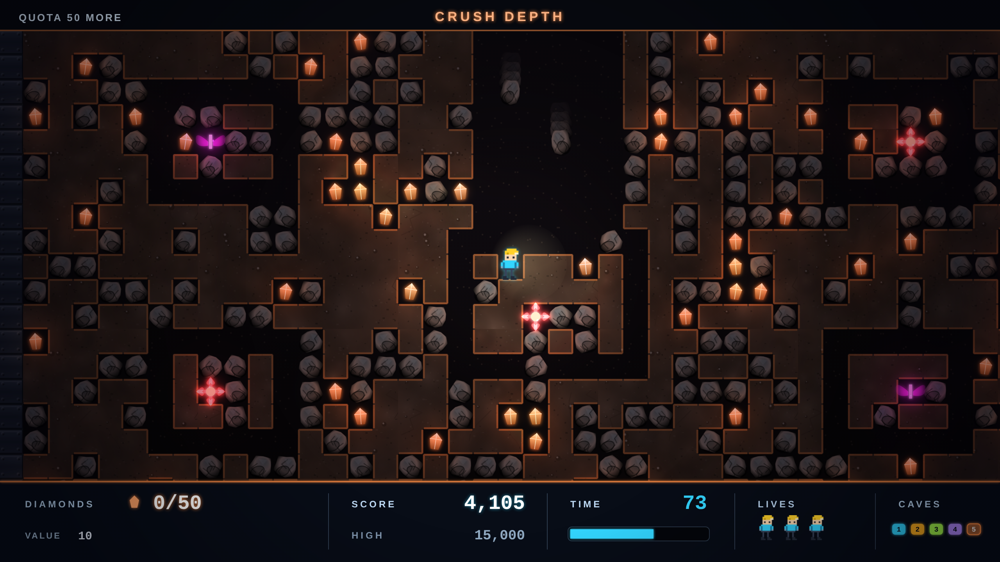

# NEON DASH

Fourth game in the harsh-critic-loop series, after
[NEONOID](https://github.com/melvincarvalho/neonoid),
[NEON MINER](https://github.com/melvincarvalho/neonminer) and
[NEODROID](https://github.com/melvincarvalho/neodroid). A Boulder Dash tribute:
Otto (returning from NEON MINER) digs five caves of authentic 1984 cellular
physics — falling boulders that roll off rounded objects, wall-following
fireflies and butterflies, quota-gated exits, a magic wall, and a clock that
prices greed. Original caves and character — the real Boulder Dash
(Peter Liepa, 1984) is copyrighted, and revered here.

**Play it: <https://melvincarvalho.github.io/neondash/>**



**There are no assets.** Every cell, creature and sound is generated from
code. Two files: `index.html`, `game.js`. WASD/arrows to move; dig by walking;
push boulders sideways.

```bash
python3 -m http.server 8000   # or just open index.html
```

## The experiment

Same pipeline as the first three games — one owner builds, deterministic
`?shot=` captures, four harsh sub-agent critics, consensus fixes, re-score to
plateau — with the harness's biggest evolution yet:

**Physics proven frame-by-frame.** `falling_0..falling_8` captures one pure
cell-tick per frame: a boulder drops, lands on a resting boulder, and rolls
off. The fidelity critic reconstructed it pixel-by-pixel and passed it:
*"sideways-then-down order, exact one-cell lateral quantization, left
preference — BD-correct."* A `magicwall_0..3` strip does the same for the
magic wall.

**A two-sided economy acceptance test.** `tools/playtest.sh` runs two bots
over every cave: a hazard-aware *careful* bot that must CLEAR all five
(completability) and a naive *greedy* bot that must FAIL (greed is priced).
Final telemetry: careful **5/5 cleared, zero deaths**; greedy **died on all
five caves** — on cave 1 with a single diamond. The round-1 fidelity verdict
("the difficulty economy is dead — greed is priced in boulders and time is
not present") was fixed by four telemetry-driven balance iterations and
verified the same way.

## Scores

| round | composition | game-feel | HUD | visual mean | BD fidelity |
|---|---|---|---|---|---|
| 1 | 4.2 | 3.4 | 4.5 | **4.0** | 5.5 |
| 2 | 6.3 | 5.6 | 6.5 | **6.1** | 7.5 |
| 3 (final) | 7.2 | 6.6 | 7.5 | **7.1** | **8.0** |

Final-round verdicts: fidelity — *"physics, economy, quota/cave flow and
death handling now read as genuine Boulder Dash; it has earned the word
'tribute'."* Composition — *"a coherent, shippable premium-itch look… it no
longer loses on craft errors, only on asset depth"* (blind A/B vs Boulder
Dash Deluxe narrowed from 90/10 to 70/30). HUD — shippable, with the timer
arithmetic literally audited (TIME 53 × 5 = BONUS +265). Four small
post-panel fixes (magic-wall staging direction, score-chain coherence,
cell-quantized blast, rising-mote celebrations) were applied after the final
scores; the numbers above are the panel's, not post-fix.

## Honest assessment

- **Amoeba and slime are absent** — the magic wall is the only chemistry-set
  member shipped; canon's growth systems remain future work.
- **Five caves, one difficulty level** vs the original's 20 + intermissions ×5.
- **Falling-boulder smears read faint** at a glance; weight is telegraphed
  but not yet felt.
- **Resolution clash**: chunky pixel Otto against smoothly-shaded terrain —
  two rendering languages in one frame.
- Staged evidence shots are separate runs, not one continuous playthrough.

## Process notes

1. **The two-sided test found real design flaws**, not just balance numbers:
   1-wide maze gaps could be plugged by falling boulders (sealing the exit
   for a push-less bot), and a trap placed on a wall row made two gems
   unreachable. Both caught by STUCK telemetry, both design fixes.
2. **Evidence must be staged as carefully as systems are built.** Across
   three rounds, critics caught: a physics strip ending one tick before the
   rule it proved, staged shots all reading t≈0 (an honest clock testifying
   to a frozen one), a teleported hero rendering at his pre-teleport
   position, and a magic-wall strip proving the inverse direction. The
   staging bugs were as instructive as the game bugs.
3. **Balance tuning was five iterations of telemetry, zero of vibes.**

## License

Copyright © 2026 Melvin Carvalho.

Licensed under the [GNU Affero General Public License v3.0 or later](LICENSE)
(AGPL-3.0-or-later).
